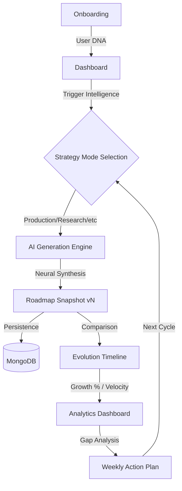

# HireReady

**HireReady** is an AI-powered Career Intelligence Platform that helps users become hiring-ready through resume analysis, AI mock interviews, personalized roadmaps, skill-gap detection, and career insights.

---

## 🚀 Core Features

### 1. Intelligence Roadmap Engine
Generates highly personalized, week-by-week career blueprints using **Gemini 1.5 Flash**. It analyzes your current "Career DNA" and target roles to build a "Career Operating System."

### 2. 7 Evolution Strategy Modes
Choose a specific professional "personality" for the AI to prioritize during roadmap generation:
- **Production AI Path**: High-scale engineering focus.
- **Research SOTA**: Deep dive into papers and state-of-the-art models.
- **Rapid Career Pivot**: Accelerated learning for industry switchers.
- **Deep Infrastructure**: Focus on ML Ops and system design.
- **Product-Minded Engineer**: Bridging technical depth with business impact.

### 3. Career Evolution Timeline
A cinematic history system that treats your career as a series of "Snapshots":
- **Growth Delta**: Automatically calculates % improvement between roadmap versions.
- **Readiness Velocity**: Visualizes your trajectory toward market-competitive levels.
- **AI Evolution Feedback**: Contextual insights on strategy shifts and skill unlocks.

### 4. Cinematic Analytics Dashboard
Real-time visualizing of your professional status:
- **Skill Radar Charts**: Multidimensional breakdown of core competencies.
- **Trajectory Graphs**: Time-based growth forecasting.
- **Market Readiness Stats**: High-visibility KPIs for recruiter-grade readiness.

### 5. Intelligent Resumé Ecosystem
- **AI Resume Enhancement**: Real-time tailoring of your experience.
- **Fix My Resume Roadmap**: A corrective action plan specifically to fill experience gaps found in your resume.

---

## 🔄 Workflow



1.  **Onboarding**: The system establishes your baseline skills and target trajectory.
2.  **Strategic Generation**: Select an Evolution Strategy to guide the AI's technical depth.
3.  **Snapshot Synthesis**: The engine generates a comprehensive JSON blueprint with weekly tasks and project recommendations.
4.  **Evolution Tracking**: Every generation creates a "Snapshot," allowing the system to track growth deltas and progression.
5.  **Execution & Analytics**: Monitor readiness through the **Vertical Timeline** and **Velocity Charts**.

---

## 🛠 Tech Stack

- **Frontend**: Next.js 15 (App Router), React 19, Tailwind CSS.
- **Animations**: Framer Motion (Glassmorphic effects & Cinematic transitions).
- **Data Visualization**: Recharts (Radar, Area, and Line charts).
- **Icons**: Lucide-react.
- **Backend**: Python (Flask/FastAPI), MongoDB.
- **AI Engine**: Gemini 1.5 Flash (via specialized prompt engineering).
- **Infrastructure**: Firebase (Auth & Storage).

---

## 📁 Repository Structure

- `backend/services/ai_service.py`: The core AI logical engine and strategy definitions.
- `src/app/(dashboard)/roadmap/`: The primary roadmap experience and timeline UI.
- `src/app/onboarding/`: Intake system for baseline career data.
- `src/lib/api.ts`: Centralized communication with the AI backend.
- `src/utils/pdfExport.ts`: Generates high-fidelity PDF career reports.

---

## ⚡ Getting Started

### Prerequisites
- Node.js 18+
- Python 3.9+
- MongoDB instance

### Installation
1. **Frontend**:
   ```bash
   npm install
   npm run dev
   ```
2. **Backend**:
   ```bash
   cd backend
   pip install -r requirements.txt
   python app.py
   ```

---

*Built with ❤️ for the next generation of AI Engineers.*

